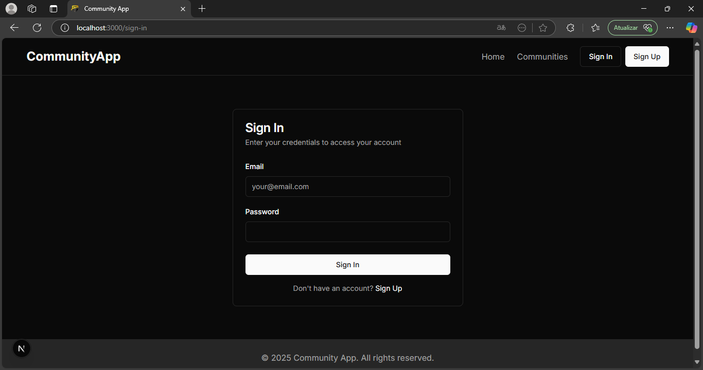
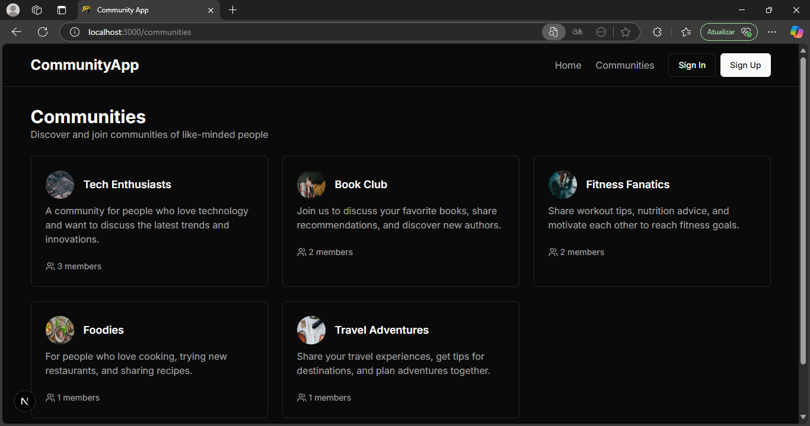
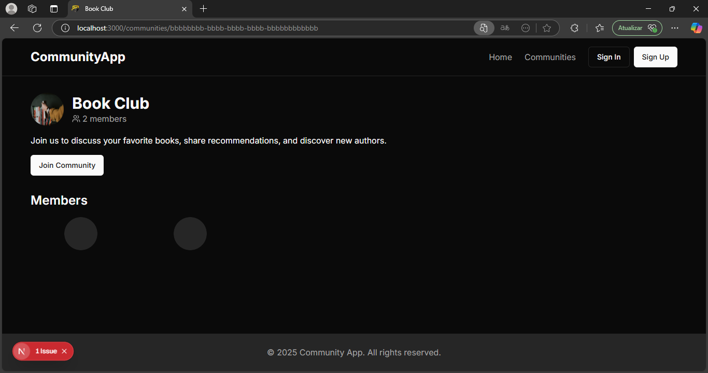

# Community App

Uma aplicação web moderna para criar e gerenciar comunidades online, com chat em tempo real e integração com IA.

## 🚀 Funcionalidades

- 🔐 Autenticação de usuários
- 👥 Criação e gerenciamento de comunidades
- 💬 Chat em tempo real para membros
- 🤖 Integração com IA para respostas automáticas
- 📱 Interface responsiva e moderna
- 🔄 Atualizações em tempo real

## 📋 Pré-requisitos

- Node.js 18+ 
- npm ou yarn
- Conta no Supabase
- Conta no Cloudinary (opcional, para upload de imagens)

## 🔧 Instalação

1. Clone o repositório:
```bash
git clone https://github.com/seu-usuario/community-app.git
cd community-app
```

2. Instale as dependências:
```bash
npm install
# ou
yarn install
```

3. Configure as variáveis de ambiente:
Crie um arquivo `.env.local` na raiz do projeto com as seguintes variáveis:

```env
NEXT_PUBLIC_SUPABASE_URL=sua_url_do_supabase
NEXT_PUBLIC_SUPABASE_ANON_KEY=sua_chave_anonima_do_supabase
CLOUDINARY_CLOUD_NAME=seu_nome_do_cloudinary
CLOUDINARY_API_KEY=sua_chave_api_do_cloudinary
CLOUDINARY_API_SECRET=seu_secret_do_cloudinary
```

## 🛠️ Configuração do Supabase

1. Crie uma conta no [Supabase](https://supabase.com)
2. Crie um novo projeto
3. Configure as tabelas necessárias:

```sql
-- Tabela de comunidades
create table communities (
  id uuid default uuid_generate_v4() primary key,
  name text not null,
  description text,
  image_url text,
  created_by uuid references auth.users(id),
  created_at timestamp with time zone default timezone('utc'::text, now()) not null
);

-- Tabela de membros da comunidade
create table community_members (
  id uuid default uuid_generate_v4() primary key,
  community_id uuid references communities(id) on delete cascade,
  user_id uuid references auth.users(id) on delete cascade,
  role text default 'member',
  joined_at timestamp with time zone default timezone('utc'::text, now()) not null
);

-- Tabela de mensagens do chat
create table messages (
  id uuid default uuid_generate_v4() primary key,
  community_id uuid references communities(id) on delete cascade,
  user_id uuid references auth.users(id) on delete cascade,
  content text not null,
  created_at timestamp with time zone default timezone('utc'::text, now()) not null
);

-- Políticas de segurança
alter table communities enable row level security;
alter table community_members enable row level security;
alter table messages enable row level security;

-- Políticas para comunidades
create policy "Communities are viewable by everyone"
  on communities for select
  using (true);

create policy "Users can create communities"
  on communities for insert
  with check (auth.uid() = created_by);

-- Políticas para membros
create policy "Community members are viewable by everyone"
  on community_members for select
  using (true);

create policy "Users can join communities"
  on community_members for insert
  with check (auth.uid() = user_id);

-- Políticas para mensagens
create policy "Messages are viewable by community members"
  on messages for select
  using (
    exists (
      select 1 from community_members
      where community_members.community_id = messages.community_id
      and community_members.user_id = auth.uid()
    )
  );

create policy "Users can send messages to communities they are members of"
  on messages for insert
  with check (
    exists (
      select 1 from community_members
      where community_members.community_id = messages.community_id
      and community_members.user_id = auth.uid()
    )
  );
```

## 🏃‍♂️ Como Executar

1. Inicie o servidor de desenvolvimento:
```bash
npm run dev
# ou
yarn dev
```

2. Acesse a aplicação em:
```
http://localhost:3000
```

## 📸 Demonstração

### Página Inicial


### Lista de Comunidades


### Detalhes da Comunidade


### Chat da Comunidade


## 🛠️ Tecnologias Utilizadas

- Next.js 13+ (App Router)
- TypeScript
- Supabase (Banco de dados e autenticação)
- Tailwind CSS
- Shadcn/ui
- Cloudinary (Upload de imagens)

## 📝 Estrutura do Projeto

```
community-app/
├── app/                    # Páginas da aplicação
├── components/            # Componentes React
├── contexts/             # Contextos React
├── lib/                  # Utilitários e configurações
├── public/              # Arquivos estáticos
└── types/               # Definições de tipos TypeScript
```

## 🤝 Contribuição

1. Faça um fork do projeto
2. Crie uma branch para sua feature (`git checkout -b feature/AmazingFeature`)
3. Commit suas mudanças (`git commit -m 'Add some AmazingFeature'`)
4. Push para a branch (`git push origin feature/AmazingFeature`)
5. Abra um Pull Request

## 📄 Licença

Este projeto está sob a licença MIT. Veja o arquivo [LICENSE](LICENSE) para mais detalhes.

## ✨ Agradecimentos

- [Next.js](https://nextjs.org)
- [Supabase](https://supabase.com)
- [Tailwind CSS](https://tailwindcss.com)
- [Shadcn/ui](https://ui.shadcn.com) 
